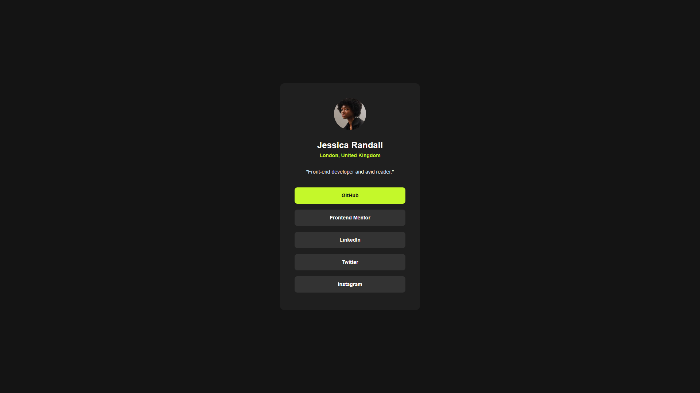

# Frontend Mentor - Social links profile solution

This is a solution to the [Social links profile challenge on Frontend Mentor](https://www.frontendmentor.io/challenges/social-links-profile-UG32l9m6dQ). Frontend Mentor challenges help you improve your coding skills by building realistic projects. 

## Table of contents

- [Overview](#overview)
  - [Screenshot](#screenshot)
  - [Links](#links)
- [My process](#my-process)
  - [Built with](#built-with)
  - [What I learned](#what-i-learned)
  - [Continued development](#continued-development)

**Note: Delete this note and update the table of contents based on what sections you keep.**

## Overview

### Screenshot

### Links

- Solution URL: [CODE](https://github.com/cravsky/social-links-profile)
- Live Site URL: [LIVE](https://cravsky.github.io/social-links-profile/)

## My process

### Built with

- HTML5
- CSS
- Flexbox

### What I learned

I practiced reading Figma designs. I learned that 90% of design implementation takes 10% of time. And the rest 10% of work takes 90% of time.

### Continued development

I would like to improve translating Figma designs to CSS rules.
